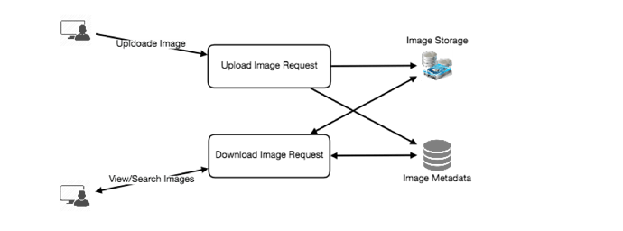

System design questions have become a standard part of the software engineering interview process. Performance in these interviews reflects  
upon your ability to work with complex systems and translates into the position and salary the interviewing company offers you. Most  
engineers struggle with system design interview (SDI), partly because of their lack of experience in developing large-scale systems, and partly  
because of the unstructured nature of SDIs. Even engineers, who’ve some experience building such systems, aren’t comfortable with these  
interviews, mainly due to the open-ended nature of design problems that don’t have a standard answer. This course is a complete guide to  
master the SDIs. It is created by hiring managers who’ve been working at Google, Facebook, Microsoft, and Amazon. We’ve carefully chosen a  
set of questions, that haven’t only been repeatedly asked at top companies but also provide a thorough experience to handle any system  
design problem. Let’s get started!

**System Design Interviews: A step by step guide**

Lots of people struggle with system design interviews (SDIs) primarily because of 1) Unstructured nature of SDIs, where you’re asked to work on an open-ended design problem that doesn’t have a standard answer, 2) Your lack of experience in developing large scale systems and, 3) You did not spend enough time to prepare for SDIs.

Just like coding interviews, candidates who haven’t put a conscious effort to prepare for SDIs, mostly perform poorly. This gets aggravated when you’re interviewing at the top companies like Google, Facebook, Uber, etc. In these companies, if a candidate doesn’t perform above average, they have a limited chance to get an offer. On the other hand, a good performance always results in a better offer (higher position and salary), since it reflects upon your ability to handle large complex systems - a skill that all such companies require.

In this course, we’ll follow a step by step approach to solve multiple design problems. Here are those seven steps:

Step 1: Requirements clarifications

Always ask questions to find the exact scope of the problem you’re solving. Design questions are mostly open-ended, and they don’t have ONE correct answer, that’s why clarifying ambiguities early in the interview becomes critical. Candidates who spend enough time to define the end goals of the system, always have a better chance to be successful in the interview. Also, since you only have 35-40 minutes to design a (supposedly) large system, you should clarify what parts of the system you would be focusing on.

Under each step, we’ll try to give examples of different design considerations for developing a Twitter-like service.

Here are some questions for designing Twitter that should be answered before moving on to the next steps:

-   Will users of our service be able to post tweets and follow other people?
-   Should we also design to create and display user’s timeline?
-   Will tweets contain photos and videos?
-   Are we focusing on backend only or are we developing front-end too?
-   Will users be able to search tweets?
-   Do we need to display hot trending topics?
-   Would there be any push notification for new (or important) tweets?

All such question will determine how our end design will look like.

Step 2: System interface definition

Define what APIs are expected from the system. This would not only establish the exact contract expected from the system but would also ensure if you haven’t gotten any requirements wrong. Some examples for our Twitter-like service would be:

postTweet(user_id, tweet_data, tweet_location, user_location, timestamp, …)

generateTimeline(user_id, current_time, user_location, …)

markTweetFavorite(user_id, tweet_id, timestamp, …)

Step 3: Back-of-the-envelope estimation

It’s always a good idea to estimate the scale of the system you’re going to design. This would also help later when you’ll be focusing on scaling, partitioning, load balancing and caching.

-   What scale is expected from the system (e.g., number of new tweets, number of tweet views, how many timeline generations per sec., etc.)?
-   How much storage will we need? We will have different numbers if users can have photos and videos in their tweets.
-   What is the network bandwidth usage we expect? This would be crucial in deciding how would we manage traffic and balance load between servers.

Step 4: Defining data model

Defining the data model early will clarify how data will flow among different components of the system. Later, it will guide towards data partitioning and management. Candidate should be able to identify various entities of the system, how they will interact with each other and different aspect of data management like storage, transportation, encryption, etc. Here are some entities for our Twitter-like service:

**User:**  UserID, Name, Email, DoB, CreationData, LastLogin, etc.  
**Tweet:**  TweetID, Content, TweetLocation, NumberOfLikes, TimeStamp, etc.  
**UserFollowos:**  UserdID1, UserID2  
**FavoriteTweets:**  UserID, TweetID, TimeStamp

Which database system should we use? Would NoSQL like  [Cassandra  19](https://en.wikipedia.org/wiki/Apache_Cassandra)  best fits our needs, or we should use a MySQL-like solution. What kind of block storage should we use to store photos and videos?

Step 5: High-level design

Draw a block diagram with 5-6 boxes representing the core components of your system. You should identify enough components that are needed to solve the actual problem from end-to-end.

For Twitter, at a high level, we would need multiple application servers to serve all the read/write requests with load balancers in front of them for traffic distributions. If we’re assuming that we’ll have a lot more read traffic (as compared to write), we can decide to have separate servers for handling these scenarios. On the backend, we need an efficient database that can store all the tweets and can support a huge number of reads. We would also need a distributed file storage system for storing photos and videos.

[

5759778777202688.png975×363 41.9 KB

Step 6: Detailed design

Dig deeper into 2-3 components; interviewers feedback should always guide you towards which parts of the system she wants you to explain further. You should be able to provide different approaches, their pros and cons, and why would you choose one? Remember there is no single answer, the only important thing is to consider tradeoffs between different options while keeping system constraints in mind.

-   Since we will be storing a massive amount of data, how should we partition our data to distribute it to multiple databases? Should we try to store all the data of a user on the same database? What issue can it cause?
-   How would we handle hot users, who tweet a lot or follow lots of people?
-   Since user’s timeline will contain most recent (and relevant) tweets, should we try to store our data in such a way that is optimized to scan latest tweets?
-   How much and at which layer should we introduce cache to speed things up?
-   What components need better load balancing?

Step 7: Identifying and resolving bottlenecks

Try to discuss as many bottlenecks as possible and different approaches to mitigate them.

-   Is there any single point of failure in our system? What are we doing to mitigate it?
-   Do we’ve enough replicas of the data so that if we lose a few servers, we can still serve our users?
-   Similarly, do we’ve enough copies of different services running, such that a few failures will not cause total system shutdown?
-   How are we monitoring the performance of our service? Do we get alerts whenever critical components fail or their performance degrade?

In summary, preparation and being organized during the interview are the keys to be successful in system design interviews.